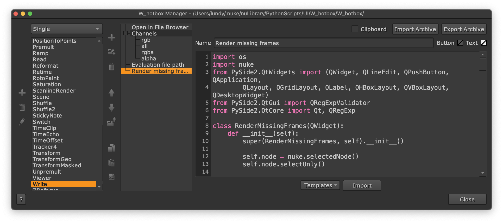
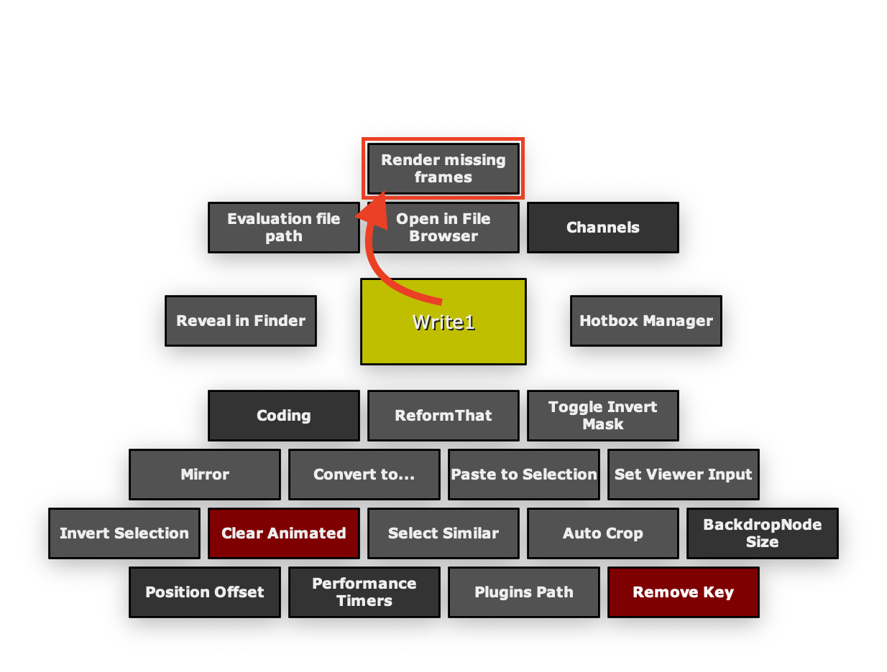

<h1 align='center'>
  Render Missing Frames
</h1>

 

## Introduce
This script will check for missing frames in the rendered sequence of the `Write` node, and then render only those frames.

 

## Usage
> Suggestion: Nuke 13 or later

Select a `Write` node, then run the script.

- The file type must be `sequence` and must follow the rules `<path>/<name>.<frame number variable>.<extension>`

  example: `<path>/final_comp_v001.%04d.exr` or `<path>/final_comp_v001.####.exr`

 

## Installation
Put the code into the `W_hotbox`.

